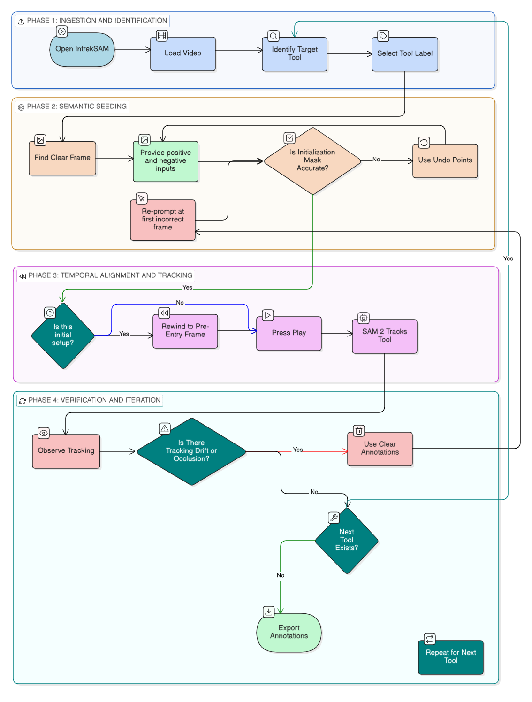

# LEARNING CURVE

## Annotation Guide: Standard Operating Procedure

Follow these phases to generate high-fidelity ground truth masks. This workflow is optimized for the **Cataract-1K** dataset to ensure temporal consistency and physical accuracy.

---

### Phase 1: Ingestion & Tool Identification
1. **Initialize:** Launch the **IntrekSAM** application.
2. **Data Loading:** Click **Load Auto** to automatically retrieve the next unannotated video from your input directory.
   * Alternatively, use **Load Video** to select a specific sequence manually.
   * Or, use **Load Video frames** to load pre-extracted image directories. This method is optimized for long-duration videos that exceed standard hardware memory buffers.
3. **Define Target:** From the **Class Selection Sidebar**, select the label corresponding to the instrument you intend to track (e.g., *Phaco Tip*).
 

---

### Phase 2: Semantic Seeding (Initial Frame)
1. **Locate Clear Frame:** Use the **Frame Slider** to find a frame where the target tool is clearly visible and its boundaries are distinct.
2. **Interactive Prompting:**
   * **Positive Prompts (Left-Click):** Place points on the tool body to define the mask area.
   * **Negative Prompts (Right-Click):** Place points on specular reflections, fluid bubbles, or background tissue to refine the mask edges.
3. **Verify Mask:** If a "transient mis-click" occurs, use **Undo Points** to remove all points in the current frame for selected class. Ensure the mask perfectly encapsulates the physical tool before proceeding.

---

### Phase 3: Temporal Alignment & Tracking
1. **The Rewind Rule:** For the **initial setup** of a tool, drag the slider back to the frame immediately *before* the tool enters the field of view.
2. **Initiate Tracking:** Press **Play**. The SAM 2 engine will begin tracking the tool from its point of entry using the established semantic memory.
3. **Monitor Propagation:** Observe the **Main Display Canvas** as the mask propagates forward through the sequence.

---

### Phase 4: Verification & Multi-Tool Iteration

1. **Observe Tracking:** Monitor the **Main Display Canvas** as the mask propagates. Use the **Left/Right Arrow Keys** for precise frame-by-frame verification of the mask's fidelity.
2. **Drift Correction:** If the mask deviates from the tool boundary or an occlusion occurs:
   * **Pause** the video at the **first incorrect frame** using frame steppers.
   * Click **Clear Annotations** to flush the predicted memory buffer from the current frame to the end of the sequence ($t \to \infty$).
   * **Re-prompt** at that exact frame to "re-seed" the model and press **Play** to resume tracking. (**Note:** Do not rewind for mid-sequence corrections).
3. **Iteration Check:** Once the sequence for the current tool is complete, determine if additional instruments (e.g., *Spatula*) require annotation.
   * **If Next Tool Exists:** Return to **Phase 1** to select the new tool label and begin its semantic seeding process.
4. **Final Export:** After all instruments in the video have been accurately masked and verified, click **Export Annotations**.
