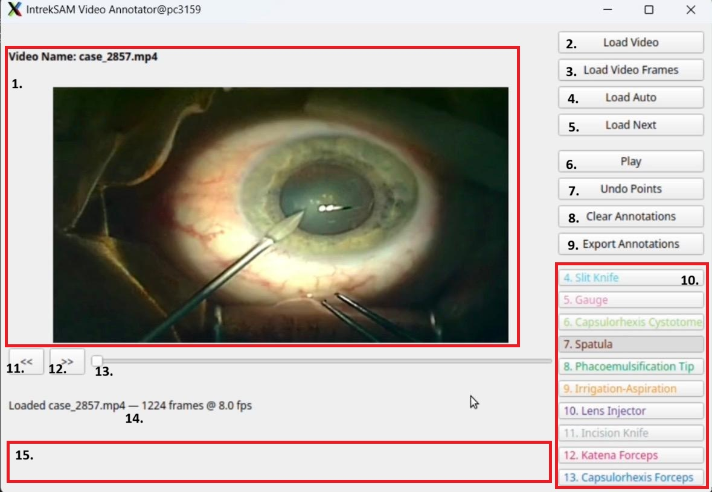

# INSTRUCTIONS

This guide provides the instruction on how to use IntrekSAM to generate high-fidelity ground truth video segmentation. There is a learning curve when annotating videos with IntrekSAM, knowing how and when to prompt, when to start propagation, how to handle misclicks, and how to manage multiple objects. Follow these instructions to gain a clear understanding before getting started.

---

The below diagram provides a comprehensive overview of the IntrekSAM interface, connecting the regions to the functional descriptions listed in the table following the image.

## 🛠 Interface & Shortcut Reference

| ID | Button / Element | Function | Shortcut |
| :--- | :--- | :--- | :--- |
| 1. | **Canvas** | Interactive display area for video playback and to place prompts. (Left-Click -> Positive Prompt) and (Right-Click -> Negative Prompt). | `Left/Right Click` |
| 2. | **Load Video** | Opens a file browser to manually select and load a video file. | - |
| 3. | **Load Video Frames** | Imports a sequence of pre-extracted images from a specified directory. Use it in case of long videos and limited resources. (See README.md) | - |
| 4. | **Load Auto** | Automatically retrieves first video without an annotation from input_video_dir. | - |
| 5. | **Load Next** | Loads the next video in the directory of the current video. | - |
| 6. | **Play / Pause** | Toggles the SAM2 propagation to start or stop mask tracking. When paused, SAM2 predictor state is reset. | `Middle Mouse` |
| 7. | **Undo Points** | Removes the placed positive and negative prompts of the selected class on the current frame from SAM2 predictor state. | - |
| 8. | **Clear Annotations** | Flushes the predicted masks of all classes from the current frame till the end of the video. But keeps the SAM2 predictor state, so prompts placed after pressing pause will be propagated. To clear SAM2 predictor state, just press play and pause. | - |
| 9. | **Export Annotations** | Exports all generated masks of the current video to the output_ann_dir. | - |
| 10. | **Taxonomy Sidebar** | List of selectable instrument classes (e.g., Spatula, Phaco Tip) used to label the active mask. | `[1] - [9]` (Ordinal Mapping, eg. `[2]` for Gauge) |
| 11. | **`<<` Button** | Steps the video backward by a single frame for precise alignment. | `Left Arrow` |
| 12. | **`>>` Button** | Steps the video forward by a single frame for precise alignment. | `Right Arrow` |
| 13. | **Frame Slider** | Allows for rapid scrubbing and navigation through the entire video duration. | - |
| 14. | **Frame Counter** | Displays the current frame index relative to the total frame count of the video. | - |
| 15. | **Status Update** | Console log providing real-time feedback on user actions and system coordinates. | - |

---

### Phase 1: Ingestion & Tool Identification
1. **Initialize:** Launch the **IntrekSAM** application.
2. **Data Loading:** Click **Load Auto** to automatically retrieve the next unannotated video from your input directory.
   * Alternatively, use **Load Video** to select a specific sequence manually.
   * Or, use **Load Video frames** to load pre-extracted image directories. This method is optimized for long-duration videos that exceed standard hardware memory buffers.
3. **Define Target:** From the **Class Selection Sidebar**, select the label corresponding to the instrument you intend to track (e.g., *Phaco Tip*).

> 

> 
<b>▶️ CLICK HERE TO WATCH:</b> <i>How to load a video file in IntrekSAM</i>

>  
> 

>   <video src="https://github.com/user-attachments/assets/4411a22e-8afc-4557-8bd1-08ffd2342e47" controls width="100%">
>   </video>
> 

> 

---

### Phase 2: Semantic Seeding (Initial Frame)
1. **Locate Clear Frame:** Use the **Frame Slider** to find a frame where the target tool is clearly visible and its boundaries are distinct.
2. **Interactive Prompting:**
   * **Positive Prompts (Left-Click):** Place points on the tool body to define the mask area.
   * **Negative Prompts (Right-Click):** Place points on specular reflections, fluid bubbles, or background tissue to refine the mask edges.
    > 

    > 
<b>▶️ CLICK TO VIEW SIDE-BY-SIDE DEMOS</b>

    >  
    >
    > | **Positive Prompts (Left-Click)** | **Negative Prompts (Right-Click)** |
    > | :---: | :---: |
    > | <video src="https://github.com/user-attachments/assets/2cb59fe1-4416-49ce-9d45-e128ecf808eb" controls width="100%"></video> | <video src="https://github.com/user-attachments/assets/3049444a-8897-4e7d-9abc-f435fe80be5a" controls width="100%"></video> |
    > | *Defines the tool body* | *Refines edges & removes noise* |
    >
    > 

3. **Verify Mask:** If a "transient mis-click" occurs, use **Undo Points** to remove all points in the current frame for selected class. Ensure the mask perfectly encapsulates the physical tool before proceeding.
    > 

    > 
<b>▶️ CLICK HERE TO WATCH:</b> <i>How to undo points in IntrekSAM</i>

    >  
    > 

    >   <video src="https://github.com/user-attachments/assets/f0b025c8-f9da-424c-ae01-cce307fdf980" controls width="100%">
    >   </video>
    > 

    > 

---

### Phase 3: Temporal Alignment & Tracking
1. **The Rewind Rule:** For the **initial setup** of a tool, drag the slider back to the frame immediately *before* the tool enters the field of view.
2. **Initiate Tracking:** Press **Play**. SAM2 will begin tracking the tool from its point of entry using the established semantic memory.
3. **Monitor Propagation:** Observe the **Main Display Canvas** as the mask propagates forward through the sequence.

> 

> 
<b>▶️ CLICK HERE TO WATCH:</b> <i> Establishing Temporal Memory: The Rewind Rule</i>

>  
> 

>   <video src="https://github.com/user-attachments/assets/ed32fa1f-3aa4-4678-9b51-d90cec807e3e" controls width="100%">
>   </video>
> 

> 

---

### Phase 4: Verification & Multi-Tool Iteration

1. **Observe Tracking:** Monitor the **Main Display Canvas** as the mask propagates. Use the **Left/Right Arrow Keys** for precise frame-by-frame verification of the mask's fidelity.
2. **Drift Correction:** If the mask deviates from the tool boundary or an occlusion occurs:
   * **Pause** the video at the **first incorrect frame** using frame steppers.
   * Optional **Clear Annotations**.
   * **Re-prompt** at that exact frame to "re-seed" the model and press **Play** to resume tracking. (**Note:** Do not rewind for mid-sequence corrections).
   * If you tracking another tool at the same time, even if it masks is not drifting, you wouneed to reprompt it, since its state is cleared after pause.

     > 

     > 
<b>▶️ CLICK HERE TO WATCH:</b> <i>How to clear annotations in IntrekSAM</i>

     >  
     > 

     >   <video src="https://github.com/user-attachments/assets/00d818d8-f16d-494a-be1b-00b4f96f3c11" controls width="100%">
     >   </video>
     > 

     > 

          
3. **Iteration Check:** Once the sequence for the current tool is complete, determine if additional instruments (e.g., *Spatula*) require annotation.
   * **If Next Tool Exists:** Return to **Phase 1** to select the new tool label and begin its semantic seeding process.
4. **Final Export:** After all instruments in the video have been accurately masked and verified, click **Export Annotations**.

    > 

    > 
<b>▶️ CLICK HERE TO WATCH:</b> <i>How to export annotations in IntrekSAM</i>

    >  
    > 

    >   <video src="https://github.com/user-attachments/assets/131e5a52-0818-4a22-ba7f-8bc33763098d" controls width="100%">
    >   </video>
    > 

    > 

---

# Best Practices for High-Fidelity Annotation

To ensure the highest data quality across any visual domain, all annotators should adhere to these professional guidelines.

---

### 1. Geometric Precision (The "Initial Seed")
* **Target the Active Region:** For elongated objects, prioritize placing points on the "active" or functional end. Avoid annotating static handles or base structures unless you would like to include entire tool in your mask.
* **Edge Anchoring:** Do not place points only in the center of the object. Strategically place positive prompts near the physical boundaries. This helps the model lock onto the object's edges against complex backgrounds.
* **The Rewind Rule:** Always initialize a new object by rewinding to the frame prior to its entry into the field of view. This provides a clean starting state for the model’s temporal memory.

---

### 2. Managing Environmental Artifacts
* **Negative Prompting for Specular Noise:** High-intensity lighting often creates glare on metallic or reflective surfaces. If a mask bleeds into a reflection, place **Negative Prompts** directly on the glare to force the mask back to the object’s physical boundary.
* **Visual Interference:** Treat bubbles or fluid distortions as background noise. Use negative prompts to ensure the object mask does not expand into these transient visual artifacts.

---

### 3. Temporal Verification & Drift Management
* **Active Review:** Pay attention to the masks propagating through the video to identify any drifts in tracking and ensure mask accuracy. 
* **The "First Frame" Correction:** At the **first frame of detected drift**, pause the video and correct the mask. Small errors compound quickly; fixing a minor drift early prevents a total tracking failure later in the sequence.

---

### 4. Multi-Object Strategy: Efficiency vs. Fidelity
* **Sequential Pass (Recommended):** Fully annotate and verify Object A before starting Object B. This is the "Gold Standard" for ensuring the model's memory bank remains focused on a single semantic target.
* **Simultaneous Pass (Advanced):** For clear sequences where objects remain physically separated, you may seed multiple objects at once by providing distinct positive and negative prompts for every active class before initiating propagation.
    * **Warning:** If one object drifts, clearing annotations will wipe progress for *all* active objects in that pass. Use this only for high-quality, low-noise footage.
